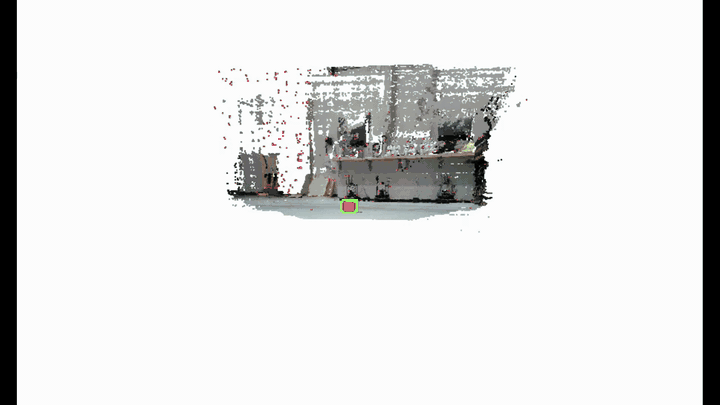
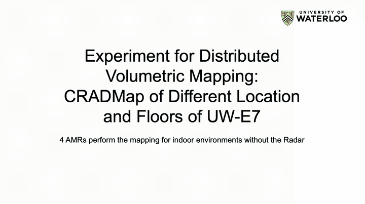
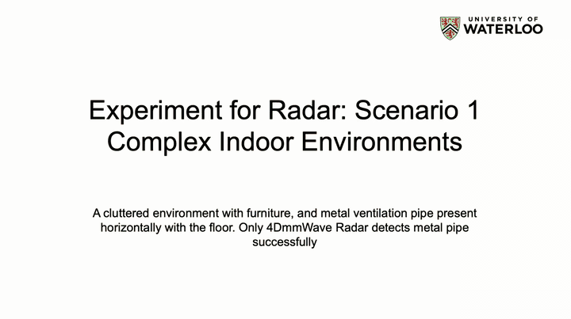
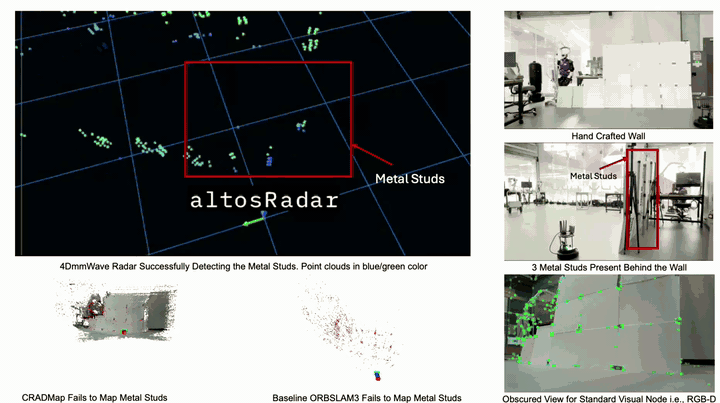

<div align="center">

# CRADMap: Applied Distributed Volumetric Mapping with 5G-Connected Multi-Robots and 4D Radar Perception

**Maaz Qureshi, Alexander Werner, Zhenan Liu, Amir Khajepour, George Shaker, William Melek**
<br>
University of Waterloo

**IEEE International Conference on Advanced Robotics and Mechatronics (ICARM) 2025** · Portsmouth, United Kingdom

[](https://ieeexplore.ieee.org/document/11293594)
[](https://doi.org/10.1109/ICARM65671.2025.11293594)
[](https://youtu.be/eTLxCY2rRMA)
[](https://docs.ros.org/en/humble/)
[](https://releases.ubuntu.com/22.04/)

### **[📄 Read the paper on IEEE Xplore](https://ieeexplore.ieee.org/document/11293594)** &nbsp;·&nbsp; **[▶ Watch the demo video on YouTube](https://youtu.be/eTLxCY2rRMA)**

<a href="https://youtu.be/eTLxCY2rRMA">
  
</a>

<sub>Click any GIF to watch the full video on YouTube. The GIFs play at 2.5–3× speed.</sub>

</div>

> [!IMPORTANT]
> **If you use CRADMap, its code, or the 4D radar driver in your research, please [cite our ICARM 2025 paper](#citation).**

---

## Overview

**CRADMap** builds dense, globally consistent **volumetric 3D maps** with a team of low-cost autonomous mobile robots (AMRs) connected over **5G**. Each robot streams compressed RGB-D data to a central server, which runs the heavy SLAM and map fusion, so the robots' onboard computers are not overloaded. A **4D mmWave radar** adds a second point-cloud map of metallic objects that cameras cannot see because they are **occluded or behind walls**. This is the "beyond the visible" part of the project.

**Highlights**

- **Distributed volumetric mapping.** ORB-SLAM3 runs per robot on the server, and the [COVINS](https://github.com/VIS4ROB-lab/covins) back-end does global optimisation. Dense keyframes are fused into a single volumetric map.
- **5G-connected multi-robot system.** Four AMRs map different areas of the UW E7 building at the same time. ROS 2 runs over public IPv6 with one Fast DDS discovery server per robot.
- **Bandwidth-efficient streaming.** On each robot, RGB images are PNG-compressed and depth images are compressed with zstd before they are sent.
- **4D radar perception.** An Altos 4D mmWave radar maps occluded metallic objects, such as a vent pipe hidden behind furniture and metal studs behind a wall, that the visual pipeline misses.

## Demo

<table>
  <tr>
    <td align="center" width="50%">
      <a href="https://youtu.be/eTLxCY2rRMA"></a>
      <br><b>Distributed mapping with 4 AMRs</b><br><sub>Lab, classroom, stairs and faculty corridor mapped at the same time</sub>
    </td>
    <td align="center" width="50%">
      <a href="https://youtu.be/eTLxCY2rRMA"></a>
      <br><b>Radar scenario 1: cluttered indoor scene</b><br><sub>Radar maps a vent pipe hidden behind furniture</sub>
    </td>
  </tr>
  <tr>
    <td align="center" colspan="2">
      <a href="https://youtu.be/eTLxCY2rRMA"></a>
      <br><b>Radar scenario 2: view fully blocked</b><br><sub>Radar maps three metal studs behind a hand-built wall</sub>
    </td>
  </tr>
</table>

## System architecture

```
 ┌─────────────── AMR ×N (TurtleBot 4 + OAK-D Pro + 4D radar) ───────────────┐
 │  OAK-D driver ──► RGB: PNG compressed  ─┐                                  │
 │                 ► Depth: zstd          ─┼──► ROS 2 (Fast DDS, IPv6) ──┐    │
 │  Quectel 5G modem (qconnect.service)    ┘                             │    │
 └───────────────────────────────────────────────────────────────────────┼───┘
                                                5G network               │
 ┌───────────────────────── Front-end server (Docker) ───────────────────▼───┐
 │  Fast DDS discovery server (one per robot, port 50075 + id)               │
 │  ORB-SLAM3 agent per robot (patched) ──► dense keyframes                  │
 └───────────────────────────────────────────────┬───────────────────────────┘
                                                 ▼
 ┌──────────────────────────── COVINS back-end ──────────────────────────────┐
 │  Global optimisation, loop closure, map merging ──► volumetric CRADMap    │
 └───────────────────────────────────────────────────────────────────────────┘
```

## Repository structure

```
CRADMap-Multi-Robot-Mapping/
├── robot/                       # runs on each AMR
│   ├── 99-qconnect.rules        # udev rule: starts the 5G modem manager when the modem appears
│   ├── qconnect.service         # systemd unit for the Quectel connection manager
│   ├── fastdds_rpi.xml.template # Fast DDS profile (IPv4 local + IPv6 over 5G)
│   └── update_fastrtps_config.sh
├── frontend/                    # runs on the central server
│   ├── fastdds.xml.template
│   └── start_discovery_server.sh
├── backend/                     # COVINS back-end configuration
│   ├── config_backend.yaml
│   └── config_comm.yaml
├── radar/                       # Altos 4D mmWave radar driver (ROS 2 + ROS 1), RViz configs
├── drivers/
│   └── quectel_5g/              # Quectel QConnectManager v1.6.5 source + 5G modem setup notes
├── docker/                      # TurtleBot 4 (UWBot) Docker image, start script and VPN tooling
├── covins/                      # COVINS framework with the ORB-SLAM3 front-end (third party, GPLv3)
├── ORB_SLAM3_ROS2/              # ROS 2 wrapper for ORB-SLAM3, patched for CRADMap (third party, GPLv3)
├── image_transport_plugins/     # image_transport plugins, including zstd (third party, BSD)
└── media/
    └── gifs/                    # demo GIFs (made from the YouTube video)
```

Everything needed to reproduce CRADMap lives in this one repository: the robot and server scripts, the 4D radar driver, the 5G modem driver and the Docker environment.

## Requirements

**AMR (robot)**

- Ubuntu 22.04 with ROS 2 Humble
- A public IPv6 address with no firewall blocking it
- About 5 MB/s of upstream bandwidth per robot
- `image_transport_plugins` (PNG and zstd compression)
- The scripts in [`robot/`](robot)

**Front-end server**

- The AMR Docker container, run with `--network=host`
- A public IPv6 address with no firewall blocking it
- Downstream bandwidth of about `ROBOT_COUNT × 5 MB/s`

> [!WARNING]
> This setup runs ROS 2 across the public internet **without any security**. Use it only on trusted networks or for research experiments.

## Getting started

```bash
git clone https://github.com/Maaz-qureshi98/CRADMap-Multi-Robot-Mapping.git
cd CRADMap-Multi-Robot-Mapping
```

### 0. Development environment (optional): Docker

[`docker/`](docker) has the TurtleBot 4 (UWBot) ROS 2 Humble container used in the experiments. Start it with `./docker/start.sh`. See [`docker/README.md`](docker/README.md) for the web interface, multi-robot containers and the VPN tunnel.

> [!NOTE]
> VPN credentials (`ca.crt`, `client.crt`, `client.key`) are **not** included. Ask the RoboHub admin for your own and place them in `docker/vpn/`. They are git-ignored.

### 1. Robot: 5G modem driver

Build the Quectel connection manager from [`drivers/quectel_5g/`](drivers/quectel_5g) and test the 5G link. Full notes, including firmware update, kernel module and AT commands, are in [`SETUP_NOTES.md`](drivers/quectel_5g/SETUP_NOTES.md).

```bash
cd drivers/quectel_5g
make
sudo ./quectel-CM -4 -6
ping -I wwan0 8.8.8.8
```

### 2. Robot: 5G connectivity and DDS

```bash
# Start the Quectel 5G connection manager automatically when the modem appears
sudo cp robot/qconnect.service /etc/systemd/system/
sudo cp robot/99-qconnect.rules /etc/udev/rules.d/
sudo systemctl daemon-reload

# Install the Fast DDS profile template, then fill it in with the 5G IPv6 address and discovery server IP
sudo cp robot/fastdds_rpi.xml.template /etc/
./robot/update_fastrtps_config.sh
```

### 3. Front-end server: discovery server

Start one discovery server for each robot, passing the robot ID. Each one listens on port `50075 + id`.

```bash
./frontend/start_discovery_server.sh 1
export FASTRTPS_DEFAULT_PROFILES_FILE=$PWD/frontend/fastdds.xml
ros2 topic bw /oakd/stereo/image_raw/zstd   # check that the compressed depth stream is arriving
```

> [!NOTE]
> The scripts share the discovery-server IP through a file on the UW RoboHub web server. If you deploy elsewhere, replace that URL in `start_discovery_server.sh` and `update_fastrtps_config.sh` with your own.

### 4. Robot: 4D mmWave radar driver

The Altos 4D radar connects to the robot over Ethernet. Build the driver from [`radar/`](radar) in the robot's ROS 2 workspace, then run:

```bash
sudo ip addr add 192.168.3.1/24 dev eth0   # put the robot on the radar's Ethernet subnet
source install/setup.bash
ros2 run altosradar altosRadarParse        # publish the radar point cloud
```

See [`radar/README.md`](radar/README.md) for the ROS 1 instructions, RViz configs and rosbag conversion.

### 5. Back-end: COVINS

Build COVINS and its ORB-SLAM3 front-end by following [`covins/readme.md`](covins/readme.md). Then use the configuration in [`backend/`](backend). Set `sys.server_ip` in `config_comm.yaml` to the IP of the machine that runs the back-end.

## Citation

If you use CRADMap, its code, or the 4D radar driver in your research, **please cite our paper**:

```bibtex
@inproceedings{qureshi2025cradmap,
  title     = {{CRADMap}: Applied Distributed Volumetric Mapping with 5G-Connected Multi-Robots and 4D Radar Perception},
  author    = {Qureshi, Maaz and Werner, Alexander and Liu, Zhenan and Khajepour, Amir and Shaker, George and Melek, William},
  booktitle = {2025 International Conference on Advanced Robotics and Mechatronics (ICARM)},
  address   = {Portsmouth, United Kingdom},
  pages     = {1--7},
  year      = {2025},
  publisher = {IEEE},
  doi       = {10.1109/ICARM65671.2025.11293594}
}
```

You can also use the **"Cite this repository"** button in the GitHub sidebar, which reads [`CITATION.cff`](CITATION.cff).

Plain-text citation (IEEE style):

> M. Qureshi, A. Werner, Z. Liu, A. Khajepour, G. Shaker and W. Melek, "CRADMap: Applied Distributed Volumetric Mapping with 5G-Connected Multi-Robots and 4D Radar Perception," in *2025 International Conference on Advanced Robotics and Mechatronics (ICARM)*, Portsmouth, United Kingdom, 2025, pp. 1–7, doi: 10.1109/ICARM65671.2025.11293594.

## Acknowledgements

This work was carried out at the [RoboHub](https://uwaterloo.ca/robohub/), University of Waterloo. It builds on [ORB-SLAM3](https://github.com/UZ-SLAMLab/ORB_SLAM3), [COVINS](https://github.com/VIS4ROB-lab/covins), [ORB_SLAM3_ROS2](https://github.com/zang09/ORB_SLAM3_ROS2) and [image_transport_plugins](https://github.com/ros-perception/image_transport_plugins).

## License

The third-party components keep their original licenses: COVINS and ORB-SLAM3 are GPLv3, image_transport_plugins is BSD, and the Quectel connection manager is distributed under the terms in [`drivers/quectel_5g/NOTICE`](drivers/quectel_5g/NOTICE). See the license file in each component's folder.
